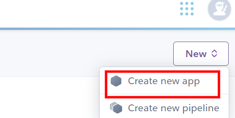
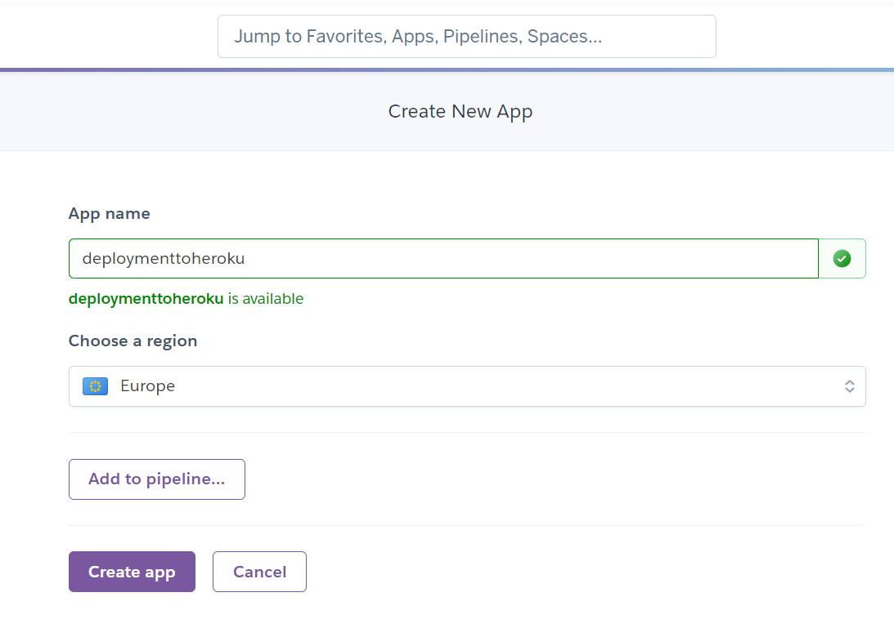

# Tennis Buddies

Tennis Buddies is an application which can be used in real life by smaller tennis clubs across the country. Its main purpose is for new but also current members of the club to find a suitable partner for tennis practice. It also enables the players to book a court to play on.

I was inspired to develop this app by two local tennis clubs back home. If I wanted to make a booking in one of them, I would have to do it by phone. In the other one, I would have to go physically to a pub connected to the tennis facilities, find the person who was the owner of the notebook where the bookings were noted down, and thus make a reservation. Both of these processes are quite incovenient. I believe this app will make booking a court a much more pleasant and smoother experience.

The other functionality revolves around finding a tennis buddy. When a new player joins the club, they often encounter difficulties in finding a suitable hitting partner. Many people already have their regular games set up and it's hard to approach them. On the other hand, there are other players who are available and willing to play, but they usually don't know about each other. Some players are looking for hitting practice, others are looking to practice for matches, still others are looking to play socially and to have fun. This app will enable the registered users to search in the clubs database and hopefully find a great tennis buddy.

The app was developed for a fictional tennis club called Nebu Tennis Club, inspired by the two above mentioned clubs.
You can access the Tennis Buddies app here:
[Tennis Buddies](https://tennis-buddies.herokuapp.com/)

[Back to top](#contents)

# Contents

- [Tennis Buddies](#tennis-buddies)
- [Contents](#contents)
- [Project](#project)
  - [Objective](#objective)
  - [Site User's Goal](#site-users-goal)
  - [Site Owner's Goal](#site-owners-goal)
- [User Experience (UX)](#user-experience-ux)
  - [User Stories](#user-stories)
    - [Primary Goal](#primary-goal)
    - [Visitor Goals](#visitor-goals)
      - [First Time Visitor](#first-time-visitor)
      - [Returning Visitor](#returning-visitor)
      - [Frequent Visitor](#frequent-visitor)
  - [Creation Process](#creation-process)
    - [Design Prototype](#design-prototype)
    - [Project Management](#project-management)
  - [Project Management](#project-management-1)
      - [GitHub Projects Board](#github-projects-board)
      - [Moscow principles, milestones, Epics, User Stories, Acceptance Criteria, Tasks, Testing](#moscow-principles-milestones-epics-user-stories-acceptance-criteria-tasks-testing)
    - [Database Schema (ERD)](#database-schema-erd)
    - [Site Structure](#site-structure)
      - [Main website](#main-website)
      - [Staff Dashboard](#staff-dashboard)
    - [App Logic](#app-logic)
  - [Design Choices](#design-choices)
    - [Typography](#typography)
    - [Color Scheme](#color-scheme)
- [Features](#features)
    - [Site Responsive Navigation Bar](#site-responsive-navigation-bar)
    - [Hero Images](#hero-images)
    - [Hours and Location](#hours-and-location)
    - [Footer](#footer)
    - [Buddy Matching Functionality (buddy.html)](#buddy-matching-functionality-buddyhtml)
    - [Booking of the courts (booking.html)](#booking-of-the-courts-bookinghtml)
      - [Sign Up Page](#sign-up-page)
      - [Sign In Page](#sign-in-page)
    - [Contact Form (contact.html)](#contact-form-contacthtml)
    - [404 and 500 Error Pages](#404-and-500-error-pages)
    - [Staff Dashboard](#staff-dashboard-1)
      - [Automatic Email Sending](#automatic-email-sending)
    - [Future Features](#future-features)
- [Technologies Used](#technologies-used)
- [Python Packages](#python-packages)
- [Testing](#testing)
    - [Manual testing](#manual-testing)
    - [External Testing](#external-testing)
    - [Automated Testing](#automated-testing)
- [Deployment to Heroku](#deployment-to-heroku)
  - [Project Deployment](#project-deployment)
  - [Create a new GitHub Repository from CI template](#create-a-new-github-repository-from-ci-template)
  - [Install Django and the supporting libraries](#install-django-and-the-supporting-libraries)
  - [Create an app on Heroku](#create-an-app-on-heroku)
  - [To fork the repository on GitHub](#to-fork-the-repository-on-github)
  - [To create a local clone of a project](#to-create-a-local-clone-of-a-project)
- [Credits](#credits)
  - [Content](#content)
  - [Media](#media)
  - [Acknowledgements](#acknowledgements)

[Back to top](#contents)

# Project

## Objective
I used to play tennis as a child. But due to my knee problems, unfortunately, I had to stop playing at a young age. When we moved to Ireland couple years ago, my children started playing tennis in the local tennis club. I never thought I wwould go back to tennis, but I tried and discovered that my limitations were gone. I had rediscovered my love and passion for tennis and have been playing frequently ever since. I was lucky to find a great hitting partner right at the beginning, but in those two years I have seen many people struggle in that respect. My local club has a great website which provides the booking functionality and I thought combining these two features and making them perhaps available to smaller local clubs would be beneficial.

When developing this project, my goal was to put my knowledge of HTML, CSS, JavaScript, Python, Bootstrap and Django Framework to use.
## Site User's Goal
The Tennis Buddies site user is a tennis aficionado. They want to find a suitable and compatible tennis partner for their practice. Also they want to be able to make a reservartion of a court to play on.
## Site Owner's Goal
As the site owner, I want to provide a platform where new tennis club members can meet and organize games, no matter what their tennis level or goals are.

# User Experience (UX)

## User Stories

### Primary Goal

The primary goal of this CLI application is to provide a simple game for children and adults to help them develop critical logical skills, but at the same time to teach them patience and perseverence, especially when playing the more difficult levels.

### Visitor Goals
Tennis Buddies game has been designed to be straightforward, with minimalist design due to using CLI. The current version is aimed at people who enjoy puzzles and challenges so they can put their logical skills to test. The user can choose a level of difficulty and can challenge themselves the beat the minimum number of moves needed.

#### First Time Visitor
  - A user can read the welcome message.
  - A user can find the game rules on the opening screen.
  - A user can choose the level of difficulty by indicating a number of disks they want to play with.
  - A user can expect a visual feedback for warnings, but also for winning the game.
  - A user can expect the number of moves to be displayed in the winning message.
  - A user can compare their number of moves with the minimum number of moves needed.
  - A user can choose to Play again after they have won, or choose to leave the game.
#### Returning Visitor
  - A user is familiar with the rules and can start the game by clicking the Run button.
  - A user can choose the level of difficulty. The more disks they choose, the more difficult the game.

#### Frequent Visitor
  - A user can try to use the minimum number of moves which according to [Wikipeadia](https://en.wikipedia.org/wiki/Tower_of_Hanoi) is 2**n - 1.


[Back to top](#contents)
## Creation Process

### Design Prototype

Wireframes, Figma
### Project Management

## Project Management
I have been using GitHub projects for organizing my project, tracking user stories and epics. It is a very helpful tool which enabled me to keep all my PBIs in one place and to tackle them gradually.

At the beginning of the project, I spent a fair amount of time on project planning, on thinking it through. I created wireframes and a sketch of my models first. Having the wireframes and the ERD model to refer to when working on the project was both essential and very helpful. Any time I was getting lost or confused, I could consult them and figure out how to proceed.

Later I jotted down as many PBIs as I could think of. I also started writing my Epics and User Stories to an excel file. Subsequently, I started using the Kanban board in projects for organizing the PBIs into Epics and User stories and assigning them to Milestones, which also served as my sprint trackers. 

At first I did not know how many story points to assign to each user story and how to organize them into sprints, so the first two to three sprints were more experimental, where I would retrospectively note down how many story points each user story took, to see how many of user story points I could do in one sprint.

I used Milestones for organizing my sprints. I know it is not ideal, but the Project tool does not have a great alternative to tracking sprints. Thus, I would create my milestones, give them a description, assing Epics and User stories to them and add a finish date for each Milestone. My sprints were usually one week long, but sometimes I had to stretch them due to a problem which took me longer to solve than I had expected.

Breaking up the project in Epics, User stories and essentially into tasks has been very helpful and enabled me to tackle the project in managable bite-size steps. Using acceptance criteria as a part of my user stories helped me define what was necessary to achieve but I could consider the user story done.

 
[Back to top](#contents)

#### GitHub Projects Board

I used Projects tool inbuilt in GitHub, [GitHub's Projects](https://github.com/lucia2007?tab=projects), to help me manage the scope of the project, to track my progress and record bugs, but also to jot down any ideas that were relevant for the application development. These ideas were either later applied in the code or dismissed if they did not seem to enhance the user's experience or improve the development process.

Whenever I had an idea related to the project, I would jot it down in the "Backlog section/Brainstorming" section. Then I would go through the tasks and assing them to the current Milestone I was working on. I would convert the simple ideas into proper User Stories with acceptance criteria and necessary tasks and move them to the To Do section. I would label each User Story with the following labels: MoSCoW, story points, relevant Epic and Milestone, priority. Some of the tasks were labeled as Developer tasks. These tasks were usually centered around the backend part of the project, getting the frameworks set up and functional.

When my Milestone with its deadline was set up (Sprint), I would assign relevant Epics with their User Stories to it. On a day-to-day basis, each morning, I would choose 2, max 3 things that were currently being worked on and I would place them in the "In Progress" section. If I became stuck on a task for whatever reason or depended on external input, I moved it to "Blocked". At last, when a task was completed, I would one more time check against the acceptance criteria, tick each of the finished tasks and move it to the "Done" section. I also made sure to work on my Readme file regularly in order to avoid having to tackle it all at once at the end. 

This tool has been very benefitial for my development process, especially, because I could rely on having all the information there. I would write down the sources to be credited, or bugs to be fixed or ideas on how to improve some part of the application, so I did not have to worry about having forgotten something crucial. And the same time, keeping everything in one place gave me peace of mind that I was not going to forget something essential.

In the future, I should able to surmise the amount of story points for each Epic/User story more easily and thus plan my Sprints more effectively.

#### Moscow principles, milestones, Epics, User Stories, Acceptance Criteria, Tasks, Testing

[GitHub Projects](readme-images/projects_tool.png)

[Back to top](#contents)
### Database Schema (ERD)

[ERD Schema]()

This is the ERD schema was instrumental for creating all the necessary models for this app. Creating this schema helped me realize the relationships between different apps and models and clarified what kind of fields each of the model components would need. Later I followed [this link](https://www.youtube.com/watch?v=6F7QMoIc_dM) to generate an extensive model of all my project apps, including the Django inbuilt models which helped me clarify some of the relationships.

  Models:
  - Buddies
  - Booking
  - allauth
  - User Profile
  - Court
  - ....


[Back to top](#contents)
### Site Structure

#### Main website
Home, Find a Buddy, Booking, Contact

#### Staff Dashboard


[Back to top](#contents)
### App Logic
  Any registered member can make a reservation of a court either for two players for singles or for 4 players for doubles. Each member is able to amend or cancel their reservation. Maximum of one booking per player is possible in one day. 

  Staff is able to access all reservations at once and can add, amend or delete any of them. The admin is also responsible for approving a new user's buddy profile. Staff/admin can make multiple reservation on a particular day, also can make reservations more in advance. Staff/admin always has priority over any bookings. Staff/admin also has to approve a new buddy.

[Back to top](#contents)

## Design Choices

I tried to keep the game design very simple and easily legible. However, I used ASCII art to make the welcome and good-bye screens a bit more interesting. I also used the ASCII Art to inform the user of their win. The winning message is in yellow color to make it stand out more.

[Back to top](#contents)
### Typography

I have not altered the type of script, as the original one is well suited for this app. 

[Back to top](#contents)

### Color Scheme

As regards the color scheme, I mostly went along with the original setting, but I did install [Colorama](https://pypi.org/project/colorama/) in order to be able to use red color of font for warnings and yellow color for the winning display.

[Back to top](#contents)

# Features
### Site Responsive Navigation Bar


Responsive (Hamburger), expandable

As soon as the page is loaded, the ASCII Art is displayed and a welcome message is gradually printed out. In the welcome message the rules and mechanism of the game are explained. 
### Hero Images


The welcome message and the rules are printed slowly so the user is not overwhelmed by the long text they would have to read when opening the app. 

The first few user options are displayed with a slight delay so the user has time to make a choice.

[Back to top](#contents)

### Hours and Location

Each time the user moves a disk from one stack/pyramid to another, the number of moves is increased. The moves are displayed when the user has accomplished moving all the disks from the first base to the third base in the winning message, see below.

[Back to top](#contents)

### Footer

including responsive image

When the user manages to move all the disks from the 1st base to the last one, they are informed of successfully finishing the game. 


[Back to top](#contents)

### Buddy Matching Functionality (buddy.html)

In order to avail of the buddy matching functionality, the user must be registered, signed in, but also his profile must be complete with all required information.

One there conditions are met, the user can search for a suitable partner by filtering categories like level, availability, type of game etc.

Buddies Cards List, Buddy card, Search functionality

After the welcome message, the user is promted to choose a number of disks they want to play with. The more disks the user chooses, the more difficult and longer the game.


The user is expected to enter a number between 3 and 6. If they choose a number smaller or bigger than the given range, they are informed of their mistake and prompted to choose a number from the indicated range. Also, they are alerted if they choose a string instead of a number.

### Booking of the courts (booking.html)

In order to book a courts, the user must have a registered account and must be signed in.

#### Sign Up Page

#### Sign In Page
- forgot password

After the user chooses a number of disks, a "playground" with the correct number of disks is displayed.


[Back to top](#contents)

### Contact Form (contact.html)
A move consists of two steps:
1. The user has to choose FROM WHICH base they want to take the top disk.
2. The user has to indicate ON WHICH base they want to place the chosen disk.


### 404 and 500 Error Pages
- If a user navigates to a page that does not exist, a customized 404 error page will appear
- If a user navigates to a page and there is a server related issue, they will be shown a customized 500 error page
  
 
 


### Staff Dashboard

#### Automatic Email Sending
### Future Features
- In the future I would like to add a possibility to book a professional hitter

- In the future I could add a scoreboard with different 

- Automatic email sending

[Back to top](#contents)

# Technologies Used
- [Github](https://github.com/) - Used for hosting the repository.
- [Heroku](https://heroku.com/) - Used for deploying the application.
- [Gitpod](https://www.gitpod.io/#get-started) - Used for developing the application.
- [Python](https://www.python.org/) - Used for adding functionality to the application.
- [Projects in GitHub](https://github.com/lucia2007?tab=projects) - Used for project managament.
- [CI Python Linter](https://pep8ci.herokuapp.com/#) - Used for validation python code.
- [Markdown Table Generator](https://www.tablesgenerator.com/markdown_tables) - Used to generate tables in Markdown.
- [Draw.io](https://marketplace.visualstudio.com/items?itemName=hediet.vscode-drawio) - Used for creating the dependency diagram.
- [Favicon Converter](https://favicon.io/favicon-converter/)

[Back to top](#contents)

# Python Packages

* [Colorama](https://pypi.org/project/colorama/) - Used to add colours to the terminal.
* [Time](https://docs.python.org/3/library/time.html) - Used for the slow print functionality and for delaying print statements.
* [Sys](https://docs.python.org/3/library/sys.html) - Used to provide access to some variables used or maintained by the interpreter.
* [Random](https://docs.python.org/3/library/random.html) - Used within the slow print functionality.
* [OS](https://docs.python.org/3/library/os.html) - Used to clear the screen in the terminal.

# Testing

For testing the application, I used manual testing and external validators. Both manual and external testing are a part of a separate testing [file](/TESTING.md).

### Manual testing
  - I used manual testing throughout the whole development phase of the project. Mainly:
    - I frequently checked if all the inputs were valid, namely if my validation functions were catching all errors and exceptions. (Details are in the [Testing file](TESTING.md).)
    - I played the game repeatedly to see if the correct winning message was displaying when the user finished the game.
    - I made sure that when the user chose to play again, they would be taken to the choice of a difficulty level and the moves counter was cleared (setting of the initial state).
    - I checked if a good-bye message displayed after the user chose not to play again.

### External Testing
  All external testing is a part of a separate testing [file](/TESTING.md).

### Automated Testing
- coverage.py

[Back to top](#contents)

# Deployment to Heroku

## Project Deployment

The application was deployed to Heroku. In order to deploy, the following steps were taken:

1. If you have an account, login to Heroku. Otherwise create a new account.
2. Once signed in, click the button "New" in the top right corner, below the header and choose "Create new app".

The project was deployed to [Heroku](https://www.heroku.com). To deploy, please follow the process below:

## Create a new GitHub Repository from CI template

1. Create a GitHub repository from the [Code Institute template](https://github.com/Code-Institute-Org/gitpod-full-template) by following the link and then click 'Use this template'.

<details><summary><b>Step 1</b></summary>


</details><br />

2. Fill in the needed details as stated in the screenshot below and then click 'Create Repository From Template'.

<details><summary><b>Step 2</b></summary>


</details><br />

3. When the repository is created, click the green 'Gitpod' button as stated in the screenshot below.

<details><summary><b>Step 3</b></summary>


</details><br />

## Install Django and the supporting libraries

4. To install Django and the supporting libraries, type the commands below.

* ```pip3 install 'django<4' gunicorn```
* ```pip3 install dj_database_url psycopg2```
* ```pip3 install dj3-cloudinary-storage```

<details><summary><b>Step 4</b></summary>


</details><br />

5. When Django and the libraries are installed we need to create a requirements file.

* ```pip3 freeze --local > requirements.txt``` - This will create and add required libraries to requirements.txt

<details><summary><b>Step 5</b></summary>


</details><br />

6. Create the project.

* ```django-admin startproject YOUR_PROJECT_NAME .``` - This will create your project

<details><summary><b>Step 6</b></summary>


</details><br />

7. When the project is created, we can now create the application.

* ```django-admin startapp APP_NAME``` - This will create your application

<details><summary><b>Step 7</b></summary>


</details><br />

8. We now need to add the application to settings.py

<details><summary><b>Step 8</b></summary>


</details><br />

9. Now do your first migration and run the server to test that everything works as expected. This is done by writing the commands below.

* ```python3 manage.py migrate``` - This will migrate the changes.
* ```python3 manage.py runserver``` - This runs the server. To test it, click the 'open browser' button that will be visible after the command is run.


## Create an app on Heroku

9. Next create our application on Heroku, attach a database, prepare our environment and settings.py file and setup the Cloudinary storage for our static and media files.

* Go to [Heroku](https://www.heroku.com/) and sign in (or create an account if needed).

* In the top right corner there is a button that is labeled 'New'. Click that and then select 'Create new app'.

<details><summary><b>Step 09</b></summary>


</details><br />

10. Enter an application name that needs to be unique. When you have chosen the name, choose your region and click 'Create app".

<details><summary><b>Step 10</b></summary>


</details><br />
   <details><summary><b>Create new app</b></summary>

   
   </details><br />

3. Choose a unique name for the application and select your region. When done, click "Create app".
   <details><summary><b>Create app</b></summary>

   
   </details><br />


4. This brings you to the "Deploy" tab. From here, click the "Settings" tab and scroll down to the "Config Vars" section and click on "Reveal Config Vars". In the KEY input field, enter "PORT" and in the VALUE input field, enter "8000". After that, click the "Add" button on the right.

   <details><summary><b>Config Vars</b></summary>

   
   </details><br />

5. Afterwards, scroll down to the "Buildpacks" section of the settings page and click the button "Add buildpack".

   <details><summary><b>Buildpacks</b></summary>

   
   </details><br />

6. First add "Python" package and then "node.js". 
   
   <details><summary><b>Choose Buildpacks</b></summary>

   
   </details><br />

7. If you exchanged the order of the packages, just drag the Python package above.
   
   <details><summary><b>Buildpacks' Order</b></summary>
   
   
   </details><br />

8. Scroll back to the top of the page and choose the "Deploy" tab. Then choose "GitHub" as Deployment method.
   
   <details><summary><b>Deployment method</b></summary>
   
   
   </details><br />

9. Go to "Connect to GiHub" section, search for the repository and then click "Connect".
   
   <details><summary><b>Connect to GitHub</b></summary>
   
   
   </details><br />

10. In the "Automatic Deploys" section, choose your preferred method for deployment. At first, I used the manual deployment option, and later I changed it to automatic deploys. Afterwards, click "Deploy Branch".
   
    <details><summary><b>Automatic Deploys</b></summary>
   
    
    </details><br />

The link to the the live site can be found here - https://towers-of-hanoi-game.herokuapp.com/.
The link to the GitHub repository can be found here - https://github.com/lucia2007/towers-of-hanoi.


[Back to top](#contents)

## To fork the repository on GitHub

A copy of the GitHub Repository can be made by forking the GitHub account. This copy can be viewed and changed without affecting the original repository. Take the following steps to fork the repository:

1. Log in to **GitHub** and locate the [repository](https://github.com/lucia2007/tennis_buddies).
2. On the top right hand side of the page is a button called **'Fork'**. Click on the button to create a copy of the original repository in your GitHub Account.

[GitHub forking process image](/readme-images/forking_process.png)

[Back to top](#contents)

## To create a local clone of a project

Take the following steps to create a clone of a project:

1. Click on the **Code** button in the left top corner.
2. Next to the green **GitPod** button, click on **Code** drop-down menu.
3. In the **HTTPS** section, click on the clipboard icon to copy the displayed URL.
4. In your IDE of choice, open **Git Bash**.
5. Change the current working directory to the location where you want the cloned directory to be made.
6. Type **git clone**, and then paste the URL copied from GitHub.
7. Press **enter** and the local clone will be created.

[Github cloning process image](/readme-images/cloning_process.png)
8. Install requirements to get the project to work by typing in this command:
   pip3 install -r requirements.txt
   This command downloads and installs all the required dependencies as found in requirements.txt file.
9. Set up environment file so that the project knows what variables are needed to make it work. These variables are usually hidden due to sensitivity of the information. You must not push the env.py file to GitHub. You 
   will achieve this by adding the env.py to the .gitignore-file. The variables that are declared in the env.py also need to be added to the Heroku config vars. Make all the relevant migrations before running the server by:
    - python3 manage.py migrate - this makes the necessary migrations
    - python3 manage.py runserver - enables the project to live locally 

  <details><summary><b>Setup env.py (incomplete image due to sensitive information)</b></summary>
   
  
  </details><br />

[Back to top](#contents)


# Credits

## Content
- I followed [this link](https://www.youtube.com/watch?v=6F7QMoIc_dM) to generate an extensive model of all my project apps, including the Django inbuilt models which helped 
- Readmes to follow: (https://github.com/worldofmarcus/project-portfolio-4/blob/main/README.md#deployment), (https://github.com/amylour/FreeFido_v2)
- Table structure in Dashboard https://www.youtube.com/watch?v=gXGQmt_U9Ao&t=65s
- Filtered booking list https://www.django-rest-framework.org/api-guide/filtering/#filtering-against-the-current-user
- To query according to url+filter https://docs.djangoproject.com/en/4.2/topics/db/queries/
- [CRUD functionality was done following Dee Mc's Recipe tutorial](https://www.youtube.com/watch?v=sBjbty691eI&list=PLXuTq6OsqZjbCSfiLNb2f1FOs8viArjWy)
- [Features section of the home page](https://easy-eater.herokuapp.com/)
- [Restrict the number of opponents](https://stackoverflow.com/questions/20203806/limit-maximum-choices-of-manytomanyfield/20230270#20230270)
- [Update Owner to current user](https://docs.djangoproject.com/en/2.0/topics/class-based-views/generic-editing/#models-and-request-user)
- [Messages](https://learn.codeinstitute.net/login?next=/courses/course-v1%3ACodeInstitute%2BFST101%2B2021_T1/courseware/b31493372e764469823578613d11036b/ae7923cfce7f4653a3af9f51825d2eba/%3Fchild%3Dfirst)
- [Delete Message](https://stackoverflow.com/questions/24822509/success-message-in-deleteview-not-shown)
- [Search Functionality](https://www.youtube.com/watch?v=LsU79aY79UA)
- [Contact Page](https://www.youtube.com/watch?v=w4ilq6Zk-08&list=PLCC34OHNcOtrZnQI6ZLvGPUWfQ6oh-D6H&index=7&t=2s)
- [Contact Form](https://ordinarycoders.com/blog/article/build-a-django-contact-form-with-email-backend)
- [If not for loop last](https://www.reddit.com/r/django/comments/13p2uuz/is_there_a_way_to_if_not_forlooplast/)
<!-- - [Send Email Tutorial](https://www.youtube.com/watch?v=xNqnHmXIuzU&list=PLCC34OHNcOtrZnQI6ZLvGPUWfQ6oh-D6H&index=8) -->
- [Check if superuser](https://stackoverflow.com/questions/65421561/how-can-i-check-if-an-user-is-superuser-in-django)
- [Image overlay](https://www.w3schools.com/howto/howto_css_overlay.asp)
- [Check if date not in the past](https://stackoverflow.com/questions/73260028/how-can-i-check-if-date-is-passed-from-django-model)
- [TestIfUserProfile Mixin](https://stackoverflow.com/a/42193610/15098344)
- [Placeholder time=now](https://docs.djangoproject.com/en/4.2/ref/templates/builtins/#now)
- [Split string and get 1st element](https://bobbyhadz.com/blog/python-split-string-and-get-last-element#split-a-string-and-get-the-first-element-in-python)
- [Convert string to datetime](https://www.freecodecamp.org/news/python-string-to-datetime-how-to-convert-an-str-to-a-date-time-with-strptime/)
- [Get success url](# https://stackoverflow.com/questions/26548018/how-to-feed-success-url-with-pk-from-saved-model)
- [Prepopulate AddBooking Form](https://stackoverflow.com/questions/22083218/django-how-to-pre-populate-formview-with-dynamic-non-model-data)
- [Generate HTML in Django](https://twitter.com/AdamChainz/status/1504231031574040578)
- [Url encode](https://stackoverflow.com/questions/64538729/how-to-url-encode-in-django-views)
## Media
- https://www.istockphoto.com/photos/tennis-friends
- https://www.coachhousevets.com/meet-the-team/the-team/no-photo-icon-22/
- [Tennis Buddies](https://www.google.com/search?q=tennis+buddies+icon&tbm=isch&ved=2ahUKEwivzZKN0LD_AhU2SEEAHdYeCk4Q2-cCegQIABAA&oq=tennis+buddies+icon&gs_lcp=CgNpbWcQAzIECCMQJzoFCAAQgAQ6BggAEAcQHjoGCAAQCBAeOgYIABAFEB46CwgAEIAEELEDEIMBOgQIABAeOgcIABAYEIAEUP4GWP0iYIIlaABwAHgAgAFoiAGKDpIBBDE3LjOYAQCgAQGqAQtnd3Mtd2l6LWltZ8ABAQ&sclient=img&ei=VzCAZO_FJLaQhbIP1r2o8AQ&bih=1441&biw=2844&rlz=1C1CHBF_csIE1041IE1041#imgrc=XSMFqBMnwoaIKM)

## Acknowledgements
- Extra help and guidance was received from my mentor Precious Ijege, from my husband Sam and fellow colleagues from the Code Institute.
- Other sources of inspiration and help:

Thank you all for your support and encouragement. I couldn't have done it without you.

[Back to top](#contents)

