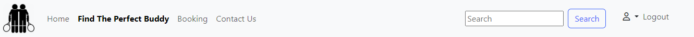
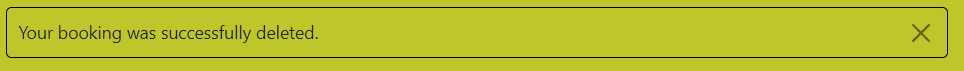
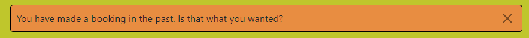

# Tennis Buddies

Tennis Buddies is an application which can be used in real life by smaller tennis clubs across the country. Its main purpose is for new but also current members of the club to find a suitable partner for tennis practice. It also enables the players to book a court to play on.

I was inspired to develop this app by two local tennis clubs back home. If I wanted to make a booking in one of them, I would have to do it by phone. In the other one, I would have to go physically to a pub connected to the tennis facilities, find the person who was the owner of a notebook where the bookings were noted down, and thus make a reservation. Both of these processes are quite incovenient. I believe this app will make booking a court a much more pleasant and smoother experience.

The other functionality revolves around finding a tennis buddy. When a new player joins a club, they often encounter difficulties in finding a suitable hitting partner. Many people already have their regular games set up and it's hard to approach them. On the other hand, there are other players who are available and willing to play, but they usually don't know about each other. Some players are looking for hitting practice, others are looking to practice for matches, still others are looking to play socially and to have fun. This app will enable the registered users to search in the club's database and hopefully find a great tennis buddy.

The app was developed for a fictional tennis club called Nebu Tennis Club, inspired by the two above mentioned clubs.

You can access the Tennis Buddies app here:
[Tennis Buddies](https://tennis-buddies.herokuapp.com/)

[Back to top](#contents)

# Contents

- [Tennis Buddies](#tennis-buddies)
- [Contents](#contents)
- [Project](#project)
  - [Objective](#objective)
  - [Site User's Goal](#site-users-goal)
  - [Site Owner's Goal](#site-owners-goal)
- [User Experience (UX)](#user-experience-ux)
  - [Primary Goal](#primary-goal)
  - [Visitor Goals](#visitor-goals)
    - [First Time Visitor](#first-time-visitor)
    - [Returning Visitor](#returning-visitor)
    - [Frequent Visitor](#frequent-visitor)
  - [Creation Process](#creation-process)
    - [Design Prototype (Wireframes)](#design-prototype-wireframes)
      - [Desktop Wireframes](#desktop-wireframes)
      - [Tablet Wireframes](#tablet-wireframes)
      - [Mobile Wireframes](#mobile-wireframes)
    - [Project Management](#project-management)
      - [Sprint #1 - 08/05 -12/05](#sprint-1---0805--1205)
      - [Sprint #2 - 15/05 - 19/05](#sprint-2---1505---1905)
      - [Sprint #3 - 22/05 -26/05](#sprint-3---2205--2605)
      - [Sprint #4 + #5 - 29/05 - 09/06](#sprint-4--5---2905---0906)
      - [Sprint #6 - 12/06 - 16/06](#sprint-6---1206---1606)
      - [Sprint #7 - 19/06 - 23/06](#sprint-7---1906---2306)
      - [Sprint #8 - 27/06 - 30/06](#sprint-8---2706---3006)
      - [Testing #9 - 03/07 - 07/07](#testing-9---0307---0707)
      - [GitHub Projects Board](#github-projects-board)
      - [Moscow principles](#moscow-principles)
      - [Milestones](#milestones)
      - [Epics](#epics)
      - [User Stories](#user-stories)
    - [Database Schema (ERD)](#database-schema-erd)
  - [Design Choices](#design-choices)
    - [Typography](#typography)
    - [Color Scheme](#color-scheme)
  - [Features](#features)
    - [Site Responsive Navigation Bar](#site-responsive-navigation-bar)
    - [Carousel](#carousel)
    - [Footer](#footer)
    - [Home Page](#home-page)
    - [Find the Perfect Buddy Page](#find-the-perfect-buddy-page)
      - [Buddy Search](#buddy-search)
      - [Buddy Details](#buddy-details)
      - [Future Features for Buddy Matching](#future-features-for-buddy-matching)
    - [Booking of the courts](#booking-of-the-courts)
      - [Booking requirements](#booking-requirements)
      - [Making a reservation](#making-a-reservation)
      - [Edit/Delete Functionality](#editdelete-functionality)
      - [Staff Dashboard](#staff-dashboard)
      - [Bookings in the past](#bookings-in-the-past)
      - [Future features for Booking](#future-features-for-booking)
    - [Contact Us page](#contact-us-page)
      - [Inquiry Confirmation Message](#inquiry-confirmation-message)
      - [Future Features for Contact Us](#future-features-for-contact-us)
      - [CLI Message](#cli-message)
    - [Profile Icon](#profile-icon)
    - [Sign Up Page](#sign-up-page)
    - [Sign In Page](#sign-in-page)
    - [Logout Page](#logout-page)
    - [Future Features Sign in functionality](#future-features-sign-in-functionality)
    - [Contact Form (contact.html)](#contact-form-contacthtml)
    - [404 and 500 Error Pages](#404-and-500-error-pages)
    - [Future Features](#future-features)
- [Technologies Used](#technologies-used)
- [Python Packages](#python-packages)
- [Testing](#testing)
    - [Manual testing](#manual-testing)
    - [External Testing](#external-testing)
    - [Automated Testing](#automated-testing)
- [Deployment to Heroku](#deployment-to-heroku)
  - [Project Deployment](#project-deployment)
  - [Create a new GitHub Repository from CI template](#create-a-new-github-repository-from-ci-template)
  - [Install Django and the supporting libraries](#install-django-and-the-supporting-libraries)
  - [Create an app on Heroku](#create-an-app-on-heroku)
  - [To fork the repository on GitHub](#to-fork-the-repository-on-github)
  - [To create a local clone of a project](#to-create-a-local-clone-of-a-project)
- [Credits](#credits)
  - [Content](#content)
  - [Media](#media)
  - [Acknowledgements](#acknowledgements)

[Back to top](#contents)

# Project

## Objective
I used to play tennis as a child. But due to my knee problems, unfortunately, I had to stop playing at a young age. When we moved to Ireland couple years ago, my children started playing tennis in the local tennis club. I never thought I wwould go back to tennis, but I tried and discovered that my physical limitations were gone. I had rediscovered my love and passion for tennis and have been playing frequently ever since. I was lucky to find a great hitting partner right at the beginning, but in those two years I have seen many people struggle in that respect. My local club has a great website which provides the booking functionality and I thought combining these two features and perhaps making them available to smaller local clubs would be beneficial.

When developing this project, my goal was to put my knowledge of HTML, CSS, JavaScript, Python, Bootstrap and Django Framework to use.

As the main objective was to apply CRUD functionality to custom made models and use a backend framework, I did not quite get my booking system or the search functionality to where I wanted them to be. But I have several custom models with full CRUD functionality in place, and I plan to improve both of my main features in the next version of this project.
## Site User's Goal
The Tennis Buddies site user is a tennis aficionado. They want to find a suitable and compatible tennis partner for their practice. Also they want to be able to make a reservartion of a court to play on.
## Site Owner's Goal
As the site owner, I want to provide a platform where new tennis club members can meet and organize games, no matter what their tennis level or goals are. I also want to make booking a court a simple, straightforward, fast experience.

# User Experience (UX)

## Primary Goal

The primary goal of this application is to enable member of a tennis club to find a tennis buddy and to make court reservations.

## Visitor Goals
As a visitor, I want to easily find a tennis partner to practise with and make a court reservation for a suitable time. I also want to be able to get in touch with the tennis club in case of any inquiries.

### First Time Visitor
  - A user sees the three main features of the app on the welcome page: Find a buddy, Book a court, Contact us
  - A user can register, log in and logout.
  - A user can see Buddy profiles on Find the perfect buddy page. 
  - A user can see details of buddies including an email address when they have signed in.
  - A logged in user can avail of the search bar to search for a buddy when on Find the Perfect Buddy tab.
  - A logged in user can click on Buddy card and be presented with their details (level, availability, preferences etc). They can also contact the chosen buddy by email to make arrangements.
  - A user can see the booking calendar and choose different dates to see court availability if not signed in.
  - A signed in user can click on a link in the booking calendar and make a reservation on the following page with the prefilled date/time/court information.
  - A signed is user can choose an opponent/s to play with when making a reservation. They can choose maximum 3 players.
  - A user is informed if they had not chosen the correct number of opponents.
  - A user is informed about a successful booking and about having made a reservation in the past if that's the case.
  - A user can add/edit/delete their contact information which can be accessed from the Profile Icon on the right (Contact Info). They are informed about having created, updated or deleted their Contact info.
  - A user can add/edit/delete their buddy information which can also be accessed from the Profile Icon (Profile).
  - Lastly, a user can see and manage their own bookings available under the Profile Icon (Your Bookings).
  - A user can contact the tennis club by filling in a form.
  - A user can easily see the location of the club on the Contact Us page.
  - A user can access useful information in the footer:
    - Links to social media
    - Opening hours
    - Site navigation
    - Recommendations for improvement
    - Contact information
  
### Returning Visitor
  - A user can easily sign in and access majority of the features of the website.
  - A user with filled in Contact info can also make court reservations.
  - A user can easily find a tennis buddy and contact them.

### Frequent Visitor
  - A user can easily make a court reservation or look for a new buddy.


[Back to top](#contents)
## Creation Process
When I started creating the web application, I had a very clear idea of what I wanted to achieve. My tennis club has a very good booking system which served as an inspiration for me. The club's booking system can be viewed [here](https://clubmanager365.com/CourtCalendar.aspx?club=shankill&sport=tennis). I liked the calendar view where a user can easily see which courts are free and make a reservation by clicking on a free cell. The club's system is of course more sophisticated and more advanced, but I tried to simulate as many of the features as possible.

### Design Prototype (Wireframes)

I started by creating wireframes which is always a great process because it helps me think in much more detail about what I want to accomplish. As you will see from my wireframes I had hoped to create a much more sophisticated search system for my "Find a Perfect Buddy" functionality, but I will have to do that in the next version due to time constraints. My booking system is almost where I wanted it to be, but it definitely needs more logical restrictions to function faultlessly and to avoid invalid reservations (more on that in Future Features).

The wireframes include a view for desktop, tablet and mobile to take responsives into accout. Many of the simple pages look the same on all devices (sign in, sign up, logout, forms,...). For those whose layout is different on smaller devices, I created a sample wireframe. The main difference in smaller screen is a collapsed NavBar accessible at the hamburger icon and the footer where the items stack up. The number of displayed tennis buddies and other relevant features also responds to the size of the screen.

I used [Figma](www.figma.com) which is an excellent tool for making wireframes.

#### Desktop Wireframes


<details><summary><b>Home Page</b></summary>
   

</details><br />

<details><summary><b>Find a Perfect Buddy</b></summary>
   

</details><br />

<details><summary><b>Buddy Details</b></summary>
   

</details><br />

<details><summary><b>Booking Calendar</b></summary>
   

</details><br />

<details><summary><b>Make a Booking</b></summary>
   

</details><br />

<details><summary><b>Staff Dashboard</b></summary>
   

</details><br />

<details><summary><b>Contact Us</b></summary>
   

</details><br />

<details><summary><b>Sign Up</b></summary>
   

</details><br />

<details><summary><b>Sign In</b></summary>
   

</details><br />

<details><summary><b>Add/Edit Contact Info</b></summary>
   

</details><br />

<details><summary><b>Add/Edit Buddy Profile</b></summary>
   

</details><br />

#### Tablet Wireframes

<details><summary><b>Home Page</b></summary>
   

</details><br />

<details><summary><b>Find a Perfect Buddy</b></summary>
   

</details><br />

#### Mobile Wireframes

<details><summary><b>Home and Find Buddy Page</b></summary>
   

</details><br />

### Project Management
I have been using GitHub projects for organizing my project, tracking user stories and epics. It is a very helpful tool which enabled me to keep all my PBIs in one place and to tackle them gradually.

At the beginning of the project, I spent a fair amount of time on project planning, on thinking it through. I created wireframes and a sketch of my models first. Having the wireframes and the ERD model to refer to when working on the project was both essential and very helpful. Any time I was getting lost or confused, I could consult them and figure out how to proceed.

Later I jotted down as many PBIs as I could think of. I also started writing my Epics and User Stories to an excel file. Subsequently, I started using the Kanban board in Projects for organizing the PBIs into Epics and User stories and assigning them to Milestones, which also served as my sprint trackers. 

At first I did not know how many story points to assign to each user story and how to organize them into sprints (milestones), so the first two to three sprints were more experimental, where I would retrospectively note down how many story points each user story took, to see how many of user story points I could do in one sprint. As am a novice at this, I am taking this as a practice run for the future projects. When I am finished with this project, I plan to make an average of the points I did in each sprit, to have a better idea how to organize my next project.

I used Milestones for organizing my sprints. I know it is not ideal, but the Project tool does not have a great alternative to tracking sprints. Thus, I would create my milestones, give them a description, assign Epics and User stories to them and add a finish date for each Milestone. My sprints were usually one week long Monday to Friday, but sometimes I had to move some issues to the next sprint due to a problem which took me longer to solve than I had expected. As I was expecting setting of the booking system to be more challenging, I planned out to do it in two sprints.

As you will see from my progress, I have always kept MVP in mind. At first I made sure the backend functionality was in place, then I started working on other crucial elements and when I had some extra time, I added some nice to have features, but always keeping in mind meeting the core project requirements first. This is visible especially with my booking system, which at first was very basic, but functional. When I assumed I would have enough time to implement the more complicated and advanced version of the booking system, I expanded on the original. When that was done, I went back to the core requirements - documentation and testing and when I felt I had a bit of time, I added a few should-haves/could-haves. Overall, primarily, I focused on completing majority of the must-haves, in later stages of the product development I would consider some should and could-haves. At the same time, I was identifying user stories which would have to change into won't haves.

Breaking up the project in Epics, User stories and essentially into tasks has been very helpful and enabled me to tackle the project in managable bite-size steps. Using acceptance criteria as a part of my user stories helped me define what was necessary to achieve before I could consider the user story done. Each user story also contained detailed tasks which had to be fulfilled before labeling the story as done.

Each of the user stories would get labels such as: must have, should have, could have, won't have; story points; epic number; user story/dev task/bug; high/medium/low priority. Each user story would be assigned to its respective epic and milestone (sprint).

My sprints were planned out as follows:

#### Sprint #1 - 08/05 -12/05
In the first milestone my main goal was to get the project's framework set up and running and do an early deployment.  I also added Login/Registration functionality using django-allauth. Most of this sprint was about setting up the backend and the tasks were labeled as Dev Task (DT). The following tasks where a part of this sprint:

- DT Install of Django Environment
- DT Create Django Project
- DT Set Up Heroku
- DT Set Up Cloudinary
- DT Deployment
- DT Set Up Django allauth
- DT Create an admin panel
- DT Create Database models from ERD
  
#### Sprint #2 - 15/05 - 19/05
Create models, general site structure and navigation elements (navbar and footer) based on the original wireframes. In this sprint I moved from the backend to setting up the basic frontend features of the app and to user stories (US). I had to fix a few crucial bugs in this sprint (BF).

- US Homepage Setup
- US Navigation
- US Footer
- US Sign Up
- US Log In
- US Log Out
- US Create User Profile
- US Create Buddy Profile
- US Edit Buddy Profile
- US Delete Buddy Profile
- DT Install Django Crispy Forms
- BF Crispy Filter not working 
- BF Set up user profile in views.py and save into database
- BF Set up Buddy profile in views.py and save into database

#### Sprint #3 - 22/05 -26/05
Finish CRUD functionality for Contact Details (user_profile), for buddy profile

- US Delete User Profile (Contact Info)
- US Edit User Profile
- US View Buddies (ListView)
- DT Readme Forking/Cloning

#### Sprint #4 + #5 - 29/05 - 09/06
The goal is to create a booking CRUD functionality which will enable the user to book a court, view, edit and delete a booking. In the meantime, add carousel and improve basic style of the app, add messages to main user actionas (CRUD).

- US Create Booking
- US View all Bookings (ListView)
- US Delete Booking
- US Edit Booking
- US Alternate List View depending on current user/staff
- US Add Carousel
- US Display messages upon user action
- DT Write up all the bugs until now

#### Sprint #6 - 12/06 - 16/06
The goal is to finish adding the main features: search functionality, contact form, improve styling of main elements.

- US Contact Us page
- US Add placeholder picture for Buddy
- US Basic Search Functionality
- US Improve website's style
- BF Favicon not loading

#### Sprint #7 - 19/06 - 23/06
Make a more advanced booking system, deploy with css and images, make progress with Readme. Connect the AddBooking form to a visual calendar which will inform the user about the court availability.

- US Make a more sophisticated visual booking system
- US Booking Calendar
- US Add Cancel button to edit/delete forms
- US Change column desctription in booking calendar
- US Inform the user when they have made a booking in the past (started in sprint #7, finalized in sprint #8)
- BF Heroku not loading css file
- BF When add booking is approached from the booking calendar, the information about date/time/court is lot

#### Sprint #8 - 27/06 - 30/06
Make progress with Readme and fix small bugs encountered during testing.

- BF Correct the flow for admin when editing/deleting a booking
- BF Fix hrefs for sign in and sign up pages


[Back to top](#contents)

#### GitHub Projects Board

I used Projects tool inbuilt in GitHub, [GitHub's Projects](https://github.com/lucia2007?tab=projects), to help me manage the scope of the project, to track my progress and record bugs, but also to jot down any ideas that were relevant for the application development. These ideas were either later applied in the code or dismissed if they did not seem to enhance the user's experience or improve the development process.

Whenever I had an idea related to the project, I would jot it down in the "Backlog section/Brainstorming" section. Then I would go through the tasks and assign them to the current Milestone I was working on. I would convert the simple ideas into proper User Stories with acceptance criteria and necessary tasks and move them to the To Do section. I would label each User Story with the following labels: MoSCoW lables, story points, relevant Epic and Milestone, priority, user story/dev task/bug-fix. The developed tasks were usually centered around the backend part of the project, getting the frameworks set up and functional, or fixing bugs, writing documentation or testing.

When my Milestone with its deadline was set up (Sprint), I would assign relevant Epics with their User Stories to it. On a day-to-day basis, each morning, I would choose 2, max 3 things that were currently being worked on and I would place them in the "In Progress" section. If I became stuck on a task for whatever reason or depended on external input, I moved it to "Blocked". At last, when a task was completed, I would one more time check against the acceptance criteria, tick each of the finished tasks and move it to the "Done" section. I also made sure to work on my Readme file regularly in order to avoid having to tackle it all at once at the end. 

The Project tool has been very benefitial for my development process, especially because I could rely on having all the relevant information in one place. I would write down the sources to be credited, or bugs to be fixed or ideas on how to improve some part of the application, so I did not have to worry about having forgotten something crucial.

In the future, I should able to surmise the amount of story points for each Epic/User story more easily and thus plan my Sprints more effectively. Also I would like to improve my process for reporting bugs in Project and connecting them to their commits. At the moment I usually took note of a bug, but only retrospectively made it into an issue. In the future I would like to use a similar process as with user stories, with acceptance criteria and tasks and connect the issue to the commit message with solved it.

#### Moscow principles
I had tried to apply MoSCoW principles in my development but more on a project basis than on a sprint basis. In my first sprints I solely focused on meeting must-have user stories and when most of my necessary features were in place, only then did I start incorporating should-haves or could-haves. As I went along, I also indentified won't-haves which were either to be fully abandoned or left for future development.

#### Milestones
I split up my project development into the following milestones:

1. Set up project's framework, do an early deployment, add django allauth.
2. Create models, general site structure and navigation elements (navbar and footer) based on the original wireframes.
3. Finish CRUD functionality for Contact Details (user_profile) and for buddy profile.
4. Basic Booking functionality, improve app content/style, add user messages.
5. Search Functionality, Contact Form, Improve Styling of Main Elements.
6. Make a more advanced booking system, deploy with css and images, make progress with Readme.
7. Make progress with Readme and fix small bugs encountered during testing
8. Testing

#### Epics
Each milestone was split into epics. Looking back at it, my epics copy milestones quite a bit and I probably should have split them into more detailed ones. Some milestones contain just one epic, others contain more. For details please look into my [Projects](https://github.com/users/lucia2007/projects/6/views/1) where you can see which epic was a part of which milestone.

1. Setup development environment, install dependencies and packages, early deployment. Install Allauth.
2. Create genereal site structure and navigation elements based on wireframes.
3. Enable CRUD functionality for User_profile and Buddy.
4. Enable CRUD functionality for Booking.
5. Add Carousel and improve website styling.
6. Add messages to user actions.
7. Add search functionality, contact form and other small embelishments.
8. Make a more advanced Booking system.
9. Fix bugs encountered during testing.

#### User Stories
Each epic would contain several user stories. Each user story has a description, acceptance criteria and tasks which had to be done before the user story could be closed and moved to done. For details as to which user story was a part of a particular epic/milestone and for the acceptance criteria/tasks, please refer to my [Projects](https://github.com/users/lucia2007/projects/6/views/1) where all the details can be found.

I split the project into following user stories:
- As a **user**, I would like to **view the apps homepage** so that I can **learn about the app and see what services it provides**.
- As a **user** I can **locate the navigation area** so that I can **easily access different parts of the website**
- As a **user**, I can **access relevant information about opening hours, contact information and social media links without having to scroll back to the top of the page** so that I can **visit the club, contact the club and follow the club online**.
- As an **unregistered user** I want to be able **to sign up onto the website** so that I can **access websites functionality and content**.
- As a **registered user** I want to be able **to sign in into my account** so that I can **get access to the website's functionality and options**.
- As a **signed in user** I want to be able **to sign out of my account** so that I can **keep my account private and safe**.
- As a **user** I can **enter my personal details** so that I can **create an account with Tennis buddies and be contacted in case of need**
- As a **signed in user with an active profile** I can **create a buddy profile** so that **I can use the search functionality to find the best tennis partner**
- As a **user**, I can **edit my buddy profile** to **update my preferences regarding the style of play/practice**.
- As a **registered user** I can **press delete button on my buddy profile form** so that I can **delete all provided information regarding my preferences for a tennis partner, including pictures**
- As a **registered user** I can **press delete button on my user profile/contact form** so that I can **delete all provided information regarding my contact details**.
- As a **user**, I can **edit my user profile** to **update my personal details**.
- As a **user** I can **visit the Find Your Perfect Buddy page** so that I can **find the perfect match for my tennis practice**.
- As a **user** I can **reserve a court** so that I can **play at a time that suits me and can avoid come to a full club**.
- As a **signed in user/staff member** I can **view all the bookings** so that I can **see when other people are playing/the courts are busy**.
- As a **registered user/superuser** I can **press delete button on my booking details** so that I can **delete my/any user's booking**.
- As a **user**, I can **edit my bookings** to **update my preferences regarding the day/time/court/opponents**.
- As a **user/staff** I can **see the list of all bookings (staff)/my own bookings (current user)** so that I can **be reminded of my reservations, but also to be able to update them or delete them**.
- As a **user** I can **be visually attracted to the app and see the main site features on the moving carousel** so that I can **quickly get an idea what the app offers**.
- As a **user I want to be informed about different user actions** so that I can **be sure that the itended action took place**.
- As a **user** I can **view the contact us page** so that I can **get in touch with the club by filling in a contact form and also see the clubs location and opening hours**.
- As a **user** I can **not add a picture to my buddy profile** so that I can **protect my privacy**.
- As a **signed in user** I can **search among the buddies** so that I can **find the best partnert to play with**.
- As a **user** I can **enjoy browsing the webpage while looking for information** so that **I don't feel compelled to leave**.
- As a **user** I can **easily see which courts are available for booking in a calendar** so that I **don't have to randomly look for free date/time/court combinations**.
- As a **signed in user** I can **easily see which courts are free on a given day** so that I **don't have to keep guessing a combination of court/time/date which would be free**.
- As a **user** I want to **press a cancel button which will take me to the previous page** so that I **don't have to use the Back button**.
- As a **user** I can **easily understand what the table lables mean** so that I can **avoid any unnecessary confusion**.
- As a **user** I **can clearly see that I made a booking in the past** so that I can **be made aware of the fact**.

The user stories above had all been finished. There are several user stories which had not been done and are postponed for future development, others were moved into won't do category. For more details see Future Features.

I realize that my attempt at agile project development was not perfect and I know I will do several things differently in the future, but it has definitely been an enriching experience and helped me manage the project's scope. In the future I plan to make more detailed Epics and to plan my sprints according to user story points, as now I have a better idea how long different tasks take me and I can make better, if imperfect, estimates.

[Back to top](#contents)
### Database Schema (ERD)

[ERD Schema]()

This is the ERD schema was instrumental for creating all the necessary models for this app. Creating this schema helped me realize the relationships between different apps and models and clarified what kind of fields each of the model components would need. Later I followed [this link](https://www.youtube.com/watch?v=6F7QMoIc_dM) to generate an extensive model of all my project apps, including the Django inbuilt models which helped me clarify some of the relationships.


  Models:
  - Buddies
  - Booking
  - allauth
  - User Profile
  - Court
  - ....

[Back to top](#contents)

## Design Choices

The goal for the site was to make it simple, easily understandable, yet attractive. I kept the used colors to a minimum and used just three images for the carousel to make the site more lively.

[Back to top](#contents)
### Typography

Originally I wanted to change the provided font-type, but in the end I was quite happy with the original one and so I did not make any alternations.

[Back to top](#contents)

### Color Scheme

As regards the color scheme, I normally would use a color scheme/wheel, but here I used only one main yellow/green color for the body and only altered the color of the messages to match it. I chose colors which are associated with tennis. I kept the header and footer white to give the site a clean look.

[Back to top](#contents)

## Features
### Site Responsive Navigation Bar


The site contains a simple but effective NavBar which simplifies the movement of the user on the site. The following links are available:
- Logo - the tennis buddy logo which evokes friendship and companionship is clickable and takes the user to the home page.
- Home - the home button takes the user to the home page.
- Find the ideal Buddy - this link takes the user to the buddies.html where the user can see a catalouge of players from which they can choose a player to engage with.
- Conditional Search functionality - if the user is signed in, they can see a search bar on the right. They can enter values like "beginner/advanced/intermediate", or "morning/afternoon/both morning and afternoon", or "hitting practice/match practice", or "singles/doubles", or "male/female".
  
  
<!-- Add info about the pop up modal if included, if not, add it to the future features -->
- Booking - this link takes the user to the bookingcalendar.html where they can see which courts are available on a particular day.
- Contact us - the contact.html page lets the user get in touch with the club and provides information about the location of the club.
- Register/Login - when the user is not logged in, they can see "Register/Login" buttons which allow then to create an accout if they don't already have on or to log in, if they already have an account.
- User Profile Icon/Logout - when the user is logged in, the links on the right change to the "Profile Icon/Logout".

  
- Conditional Profile icon appears, when the user is logged in. The user can access the following features through this icon:
  - Contact details - the user can either add their contact details through this link, or edit/delete them if the contact details had already been provided
  - Profile - the user can either create their buddy profile here, or they can edit/delete the profile if they already have one
  - Your bookings - here the user can see all of their bookings, which they can edit/delete, or they are informed about having no bookings in their name.
  

- Conditional Staff link - if the user is admin/staff, when they log in, "Staff" link appears which lets them access the bookings/list/all where they can see/edit/delete everybody's bookings.

When a user is on a particular page, the link is becomes bold to make it clear to the user which page they are on.


The NavBar is responsive and is available in its full version on large screens only. When the screen size diminishes, the NavBar is collapsed into a clickable Hamburger.


### Carousel

I used a moving carousel with three hero images to highlight the main features of the site easily accessible:
- The first image of a tennis ball on a tennis court makes the theme/content of the page clearly tennis related for any visiting user. The user can access sign in and sign up functionalities on this image.


- The second image evokes friendship and companionship. It provides links to finding a new tennis buddy.


- The third image of outdoor tennis courts shows the clubs layout and provides a shortcut to the booking system.


I created an overlay effect over the images for better legibility and accessibility. It also bring the text forward. The details of the images are not so important, as they are mainly to convery the main ideas and intentions.

The carousel also contains arrows and "dashes"/buttons to take the user to the desired carousel-image. 

On smaller screens, the text disappears to avoid making the images cluttered.


[Back to top](#contents)

### Footer

The user can find all necessary information in the footer. There is information about the opening hours of the club, there is site navigation which takes the user quickly to a desired part of the app, there are links to tips for self-improvement and lastly, there are contact details for getting in touch with the club. The footer also contains links to social media. The footer is site responsive and the items are stacked on top of each other for smaller screens, whereas they are next to each other for larger screens. 


[Footer small screens](./readme-images/footer_small_screens.png)

[Back to top](#contents)

### [Home Page](https://tennis-buddies.herokuapp.com/)

The home page contains basic information about the main features of the application. There are links to Find the Perfect Buddy, Booking and Contact us pages. 


[Back to top](#contents)
### [Find the Perfect Buddy Page](https://tennis-buddies.herokuapp.com/buddies/)

On this page the user can see a display of players who are looking for a hitting partner. You can see their picture, or a placeholder picture if they did not provide one, their name and a brief description. If they want to see a player's details, they need to be signed in.


#### Buddy Search

In order to avail of the buddy search functionality, the user must be registered and signed in. They can search for terms like: "beginner/advanced/intermediate", or "morning/afternoon/both morning and afternoon", or "hitting practice/match practice", or "singles/doubles", or "male/female". Once the user has narrowed down the players to those who match their search criteria, they can click on the card and are taken to a page where the chosen buddy details are presented.

#### [Buddy Details](https://tennis-buddies.herokuapp.com/accounts/login/?next=/buddies/"pk")

The link above should have a particular buddy's "pk" at the end of the link. The link in this form does not work. I did not provide a particular profile number, as the profile might get deleted and the link would not work.


Here the user can see the player's details such as their level, availability, preferences etc. Also an email address is present at the bottom of the form so that the user can contact the player and arrange a game with them.

If the signed user is also the owner of the buddy profile, when they click on their own card, they can see "Edit/Delete" buttons at the bottom of their card. These buttons are not present if the profile belongs to someone else.

[Buddy Detail Page](./readme-images/buddydetails_owner.png)

#### Future Features for Buddy Matching
- The admin will have to approve a profile before it can be added.
- The user can indicate if their status is active or not. If inactive, their profile would not be displayed on this page.
- The search functionality is to be more sophisticated: the user should be able to click on different available criteria and search for a combination of values, e.g. beginner + morning + doubles.
- Only the users which had created a buddy profile, will be able to search for a tennis buddy.
- The email of the registered users needs to be verified, so that the contact email address is a valid one and not a made up one which the user might have used at the registration.

[Back to top](#contents)  
### [Booking of the courts](https://tennis-buddies.herokuapp.com/bookingcalendar/)


The booking page consists of a date picker and a table with court availability on a particular day.
#### Booking requirements
In order to book a court, the user must have a registered account and must be signed in. The user also must have created a user profile where they add their contact information. This is because the club staff wants to be able to give the user a quick phone call in case of a late cancelation, last minute change, or an emergency.

#### [Making a reservation](https://tennis-buddies.herokuapp.com/bookings/add/?date=2023-06-01&time=15:00%20-%2016:00&court=three)
When the user clicks on a Booking link in NavBar or approaches it from the carousel or the footer, they are taken to bookingcalendar.html. Here the user is informed which courts are booked/free for the current date, or on the date they had chosen in the datepicker. The courts which are free contain a hyperlink. When the user clicks on a particular "Book now" link, the information about the chosen date/time/court combination is carried over to the bookings/add.html page. The user only has to choose an opponent/(s). At this point, they could still edit the time/date/court, but they would not be sure if the combination had already been booked by someone else.

The user can choose min 1 and max 3 opponents. The user chooses multiple opponents by holding shift or control. The user can also choose themselves if they want to e.g. practice their serve on their own. The user gets a warning if they choose more than 3 opponents.


The user can see a pop up message which informs them about the successful reservation at the top of the page.


[Back to top](#contents)

#### [Edit/Delete Functionality](https://tennis-buddies.herokuapp.com/bookings/list/own/)
When the user has created a booking, they are taken to bookings/list/own.html where they can view, edit or delete their own bookings. This page can also be accessed through the Profile icon, under the "Your Booking" tab. Edit and delete features are available only for the owner of the bookings. A regular user can't edit or delete somebody else's booking. 


</br>

[Back to top](#contents)


</br>
When the user has updated their booking, they can see a success message at the top of the page.


[Back to top](#contents)

</br>

</br>


[Back to top](#contents)
#### [Staff Dashboard](https://tennis-buddies.herokuapp.com/bookings/list/all/)
However, if the user is admin/staff/superuser, they will also see a "Staff" option in their NavBar through which they can access all the bookings of all the members. The staff user can edit or delete a booking of any of the users. If they access their own booking, they are taken to their booking list, but it they edit/delete somebody else's booking the staff user is taken to staff dashboard.


#### Bookings in the past
The users are allowed to create bookings in the past as well. This is due to the fact that the club requires exact information about the court usage and the members sometimes don't make a booking and just come and use a court that is free or they don't update the opponents on the booking. The club needs the information about the players in case something was damaged, or somebody got hurt (insurance reasons) or e.g. in case of the recent Covid Pandemic, they could inform the players if one them had turned Covid positive. When a booking in the past gets created, the user gets a messages about its successful creation, but is informed about having made a booking in the past.



[Back to top](#contents)
#### Future features for Booking
There are several ways how the booking system could/should be improved:
- Make the bookings accessible for e.g. next week only, so that the users can't make a booking e.g. two years in advance. 
- The user should be restricted to making one booking per day so that all players have a change to make reservations and play.
- At the moment, the combination of date/time/court is unique, but the system should also be checking if the owner has not already created a booking at that particular time/date on a different court or if the user had not been entered as an opponent for the particular time/date combination.
- The user should be sent an email after they created a booking.
- The users which were chosen as opponents should also get a confirmation and the reminder email.
- The user/opponent should also be getting an email when a booking which they are a part of has been edited or deleted.
- The user could get a confirmation email when their reservation is coming up.
- When the user approached the booking system from the calendar, they can clearly see which courts are available. However, when they are editing their booking, they don't see anymore which courts are free on the new desired date/time combination. In the future, the user should be either taken back to the calendar or get some suggestion about which courts are free so they wouldn't have to keep guessing. Maybe the user should be able to just edit the opponents and when they want to change the date/time or court, they would have to cancel the booking and add a new one through the calendar link.
- The booking calendar could display who the owner/opponents are for a particular booking instead of just "Booked".
- A member of staff should be able to create any number of bookings on a given day, in case of a special ocasion or event taking place in the club. A staff member would have a priority for booking and would be able to make bookings more in advance than a regular user. 
- In the future I should diferentiate between a superuser and staff members and adjust the conditional statements.
- A modal window should pop up when the user is chosing opponents with an information to hold shift or control buttons for choosing multiple players.
- One of the features I did not manage to do, was to create a separate booking system for staff members, where they would be able to book multiple courts on the same day for multiple hours, much more in advance in the future. (This was taking into account restrictions which are not yet in place for the user booking either: one booking per day per user, bookings only one week in advance.) And of course a staff member should be able to make a booking in anybody's name.

[Back to top](#contents)

### [Contact Us page](https://tennis-buddies.herokuapp.com/contact/)

This page contains two main sections: a form which a client can fill in if they want to get in touch with the tennis club and a Google map which shows them an exact position of the club. When the user fills in the form, they see a message about the inquiry having been sent. However, this is not fully functional yet and will be taken care of in the next version.


#### Inquiry Confirmation Message

[Back to top](#contents)

#### Future Features for Contact Us
At the moment, when the user fills in the form, they get a message about the inquiry being sent, but no email is delivered. I need to set this functionality up. At the moment, only a message in CLI appears, but only if sent from the localhost.

[Back to top](#contents)
#### CLI Message


[Back to top](#contents)
### Profile Icon
A profile Icon appears when the user is signed in. When the user clicks on the icon, they see the following options:

1. Contact Info - here the user can either [add their contact information](https://tennis-buddies.herokuapp.com/profiles/add/) if they had not done so before, or they can edit/delete the information. Contact Info is required in case the user wants to make a booking, view bookings or wants to add a buddy profile.

The user is informed about each action with a message that appears at the top of the page. Before deleting the profile, the user is asked to confirm the action. The user has an option to cancel edit/delete action in which case they are taken back to the previous page. 

- Add Contact Info   
</br>

</br>
[Add Contact Success Message](./readme-images/add_contact_success.png)

[Back to top](#contents)

- View Added Contact Info
</br>


[Back to top](#contents)

- Edit Contact Info
</br>

</br>
[Edit Contact Success Message](./readme-images/contact_update_success.png)

[Back to top](#contents)

- Delete Contact Info
</br>

</br>
[Delete Contact Success Message](./readme-images/contact_delete_success_message.png)

[Back to top](#contents)

2. Profile - A user can choose to fill in their buddy/profile details if they want to be contacted by other players to arrange a game. They are either taken to [add profile](https://tennis-buddies.herokuapp.com/profiles/add/?next=/buddies/add/) or to edit/delete profile if they had previously filled in the information. Again, the user is asked if they are sure about deletion or they can cancel edit/delete and go back to the previous page. All user actions are accompanied by a success message which appears at the top of the page. 

- Add Buddy Profile   
The only information that is prefilled in this form is the user's email address. This is not an editable field. As regards an image, if the user does not provide one, a placeholder image will be used.

The user can choose their level, availability, type of game, etc. In the future, they will also be able to say that their profile is not to appear in the catalague or in the searches (the backend functionality is not currently in place.)

</br>

</br>
[Add Buddy Success Message](./readme-images/add_buddy_success_message.png)

[Back to top](#contents)

- View Added Buddy Details
</br>
When the user approaches their own buddy details either from Profile Icon or from Find the Perfect buddies, they can see edit/delete buttons underneath their profile. These are only present when the owner of the profile is the same as the current logged in user. 

</br>

</br>

[Back to top](#contents)

- Edit Buddy Details
</br>

</br>
[Edit Buddy Success Message](./readme-images/edit_buddy_success_message.png)

[Back to top](#contents)

- Delete Buddy Details
</br>

</br>
[Delete Buddy Success Message](./readme-images/buddy_delete_success_message.png)

[Back to top](#contents)

3. Under Your Bookings the user can see/edit/delete their own bookings if they have made some, or they see a message that they have no bookings. More details above.

[Back to top](#contents)
### Sign Up Page

Sign up Page has a simple design. The user has to enter their email and the password twice. This is due to defensive programming principle where we try to avoid unnecessary errors caused by small typos.

All sign in functionalities are a result of using django-allauth. Using this packages has enabled me to set this functionality up quickly and easily.


</br>
[Sign Up Success](./readme-images/sign_up_success_message.png)

[Back to top](#contents)

### Sign In Page

</br>
[Sign In Success](./readme-images/sign_in_success_message.png)

[Back to top](#contents)
### Logout Page

</br>
[Sign Out Success](./readme-images/sign_out_success_message.png)

[Back to top](#contents)

### Future Features Sign in functionality
In the next version I would like to enable registration with social account sign in as this functionality makes the registration process much quicker and easier. Users are often dissuaded from signing up to new apps and this could facilitate the process.

At the moment, the email is not being verified and user can use a made up email. In the future I definitely want to add email verification as this is important for other features in the app, like contacting a buddy to organize a game or for contacting users in case of need by staff.

[Back to top](#contents)

### Contact Form (contact.html)
A move consists of two steps:
1. The user has to choose FROM WHICH base they want to take the top disk.
2. The user has to indicate ON WHICH base they want to place the chosen disk.


### 404 and 500 Error Pages
- If a user navigates to a page that does not exist, a customized 404 error page will appear
- If a user navigates to a page and there is a server related issue, they will be shown a customized 500 error page
  
 
 


### Staff Dashboard

#### Automatic Email Sending
### Future Features
- In the future I would like to add a possibility to book a professional hitter

- In the future I could add a scoreboard with different 

- Automatic email sending

[Back to top](#contents)

# Technologies Used
- [Github](https://github.com/) - Used for hosting the repository.
- [Heroku](https://heroku.com/) - Used for deploying the application.
- [Gitpod](https://www.gitpod.io/#get-started) - Used for developing the application.
- [Python](https://www.python.org/) - Used for adding functionality to the application.
- [Projects in GitHub](https://github.com/lucia2007?tab=projects) - Used for project managament.
- [CI Python Linter](https://pep8ci.herokuapp.com/#) - Used for validation python code.
- [Markdown Table Generator](https://www.tablesgenerator.com/markdown_tables) - Used to generate tables in Markdown.
- [Draw.io](https://marketplace.visualstudio.com/items?itemName=hediet.vscode-drawio) - Used for creating the dependency diagram.
- [Favicon Converter](https://favicon.io/favicon-converter/)
- [Regex Pattern Checker](https://regex101.com/)

[Back to top](#contents)

# Python Packages

* [Colorama](https://pypi.org/project/colorama/) - Used to add colours to the terminal.
* [Time](https://docs.python.org/3/library/time.html) - Used for the slow print functionality and for delaying print statements.
* [Sys](https://docs.python.org/3/library/sys.html) - Used to provide access to some variables used or maintained by the interpreter.
* [Random](https://docs.python.org/3/library/random.html) - Used within the slow print functionality.
* [OS](https://docs.python.org/3/library/os.html) - Used to clear the screen in the terminal.

# Testing

For testing the application, I used manual testing and external validators. Both manual and external testing are a part of a separate testing [file](/TESTING.md).

### Manual testing
  - I used manual testing throughout the whole development phase of the project. Mainly:
    - I frequently checked if all the inputs were valid, namely if my validation functions were catching all errors and exceptions. (Details are in the [Testing file](TESTING.md).)
    - I played the game repeatedly to see if the correct winning message was displaying when the user finished the game.
    - I made sure that when the user chose to play again, they would be taken to the choice of a difficulty level and the moves counter was cleared (setting of the initial state).
    - I checked if a good-bye message displayed after the user chose not to play again.

### External Testing
  All external testing is a part of a separate testing [file](/TESTING.md).

### Automated Testing
- coverage.py

[Back to top](#contents)

# Deployment to Heroku

## Project Deployment

The application was deployed to Heroku. In order to deploy, the following steps were taken:

1. If you have an account, login to Heroku. Otherwise create a new account.
2. Once signed in, click the button "New" in the top right corner, below the header and choose "Create new app".

The project was deployed to [Heroku](https://www.heroku.com). To deploy, please follow the process below:

## Create a new GitHub Repository from CI template

1. Create a GitHub repository from the [Code Institute template](https://github.com/Code-Institute-Org/gitpod-full-template) by following the link and then click 'Use this template'.

<details><summary><b>Step 1</b></summary>


</details><br />

2. Fill in the needed details as stated in the screenshot below and then click 'Create Repository From Template'.

<details><summary><b>Step 2</b></summary>


</details><br />

3. When the repository is created, click the green 'Gitpod' button as stated in the screenshot below.

<details><summary><b>Step 3</b></summary>


</details><br />

## Install Django and the supporting libraries

4. To install Django and the supporting libraries, type the commands below.

* ```pip3 install 'django<4' gunicorn```
* ```pip3 install dj_database_url psycopg2```
* ```pip3 install dj3-cloudinary-storage```

<details><summary><b>Step 4</b></summary>


</details><br />

5. When Django and the libraries are installed we need to create a requirements file.

* ```pip3 freeze --local > requirements.txt``` - This will create and add required libraries to requirements.txt

<details><summary><b>Step 5</b></summary>


</details><br />

6. Create the project.

* ```django-admin startproject YOUR_PROJECT_NAME .``` - This will create your project

<details><summary><b>Step 6</b></summary>


</details><br />

7. When the project is created, we can now create the application.

* ```django-admin startapp APP_NAME``` - This will create your application

<details><summary><b>Step 7</b></summary>


</details><br />

8. We now need to add the application to settings.py

<details><summary><b>Step 8</b></summary>


</details><br />

9. Now do your first migration and run the server to test that everything works as expected. This is done by writing the commands below.

* ```python3 manage.py migrate``` - This will migrate the changes.
* ```python3 manage.py runserver``` - This runs the server. To test it, click the 'open browser' button that will be visible after the command is run.


## Create an app on Heroku

9. Next create our application on Heroku, attach a database, prepare our environment and settings.py file and setup the Cloudinary storage for our static and media files.

* Go to [Heroku](https://www.heroku.com/) and sign in (or create an account if needed).

* In the top right corner there is a button that is labeled 'New'. Click that and then select 'Create new app'.

<details><summary><b>Step 09</b></summary>


</details><br />

10. Enter an application name that needs to be unique. When you have chosen the name, choose your region and click 'Create app".

<details><summary><b>Step 10</b></summary>


</details><br />
   <details><summary><b>Create new app</b></summary>

   
   </details><br />

3. Choose a unique name for the application and select your region. When done, click "Create app".
   <details><summary><b>Create app</b></summary>

   
   </details><br />


4. This brings you to the "Deploy" tab. From here, click the "Settings" tab and scroll down to the "Config Vars" section and click on "Reveal Config Vars". In the KEY input field, enter "PORT" and in the VALUE input field, enter "8000". After that, click the "Add" button on the right.

   <details><summary><b>Config Vars</b></summary>

   
   </details><br />

5. Afterwards, scroll down to the "Buildpacks" section of the settings page and click the button "Add buildpack".

   <details><summary><b>Buildpacks</b></summary>

   
   </details><br />

6. First add "Python" package and then "node.js". 
   
   <details><summary><b>Choose Buildpacks</b></summary>

   
   </details><br />

7. If you exchanged the order of the packages, just drag the Python package above.
   
   <details><summary><b>Buildpacks' Order</b></summary>
   
   
   </details><br />

8. Scroll back to the top of the page and choose the "Deploy" tab. Then choose "GitHub" as Deployment method.
   
   <details><summary><b>Deployment method</b></summary>
   
   
   </details><br />

9. Go to "Connect to GiHub" section, search for the repository and then click "Connect".
   
   <details><summary><b>Connect to GitHub</b></summary>
   
   
   </details><br />

10. In the "Automatic Deploys" section, choose your preferred method for deployment. At first, I used the manual deployment option, and later I changed it to automatic deploys. Afterwards, click "Deploy Branch".
   
    <details><summary><b>Automatic Deploys</b></summary>
   
    
    </details><br />

The link to the the live site can be found here - https://towers-of-hanoi-game.herokuapp.com/.
The link to the GitHub repository can be found here - https://github.com/lucia2007/towers-of-hanoi.


[Back to top](#contents)

## To fork the repository on GitHub

A copy of the GitHub Repository can be made by forking the GitHub account. This copy can be viewed and changed without affecting the original repository. Take the following steps to fork the repository:

1. Log in to **GitHub** and locate the [repository](https://github.com/lucia2007/tennis_buddies).
2. On the top right hand side of the page is a button called **'Fork'**. Click on the button to create a copy of the original repository in your GitHub Account.

[GitHub forking process image](/readme-images/forking_process.png)

[Back to top](#contents)

## To create a local clone of a project

Take the following steps to create a clone of a project:

1. Click on the **Code** button in the left top corner.
2. Next to the green **GitPod** button, click on **Code** drop-down menu.
3. In the **HTTPS** section, click on the clipboard icon to copy the displayed URL.
4. In your IDE of choice, open **Git Bash**.
5. Change the current working directory to the location where you want the cloned directory to be made.
6. Type **git clone**, and then paste the URL copied from GitHub.
7. Press **enter** and the local clone will be created.

[Github cloning process image](/readme-images/cloning_process.png)
8. Install requirements to get the project to work by typing in this command:
   pip3 install -r requirements.txt
   This command downloads and installs all the required dependencies as found in requirements.txt file.
9. Set up environment file so that the project knows what variables are needed to make it work. These variables are usually hidden due to sensitivity of the information. You must not push the env.py file to GitHub. You 
   will achieve this by adding the env.py to the .gitignore-file. The variables that are declared in the env.py also need to be added to the Heroku config vars. Make all the relevant migrations before running the server by:
    - python3 manage.py migrate - this makes the necessary migrations
    - python3 manage.py runserver - enables the project to live locally 

  <details><summary><b>Setup env.py (incomplete image due to sensitive information)</b></summary>
   
  
  </details><br />

[Back to top](#contents)


# Credits

## Content
- I followed [this link](https://www.youtube.com/watch?v=6F7QMoIc_dM) to generate an extensive model of all my project apps, including the Django inbuilt models which helped 
- Readmes to follow: (https://github.com/worldofmarcus/project-portfolio-4/blob/main/README.md#deployment), (https://github.com/amylour/FreeFido_v2)
- Table structure in Dashboard https://www.youtube.com/watch?v=gXGQmt_U9Ao&t=65s
- Filtered booking list https://www.django-rest-framework.org/api-guide/filtering/#filtering-against-the-current-user
- To query according to url+filter https://docs.djangoproject.com/en/4.2/topics/db/queries/
- [CRUD functionality was done following Dee Mc's Recipe tutorial](https://www.youtube.com/watch?v=sBjbty691eI&list=PLXuTq6OsqZjbCSfiLNb2f1FOs8viArjWy)
- [Features section of the home page](https://easy-eater.herokuapp.com/)
- [Restrict the number of opponents](https://stackoverflow.com/questions/20203806/limit-maximum-choices-of-manytomanyfield/20230270#20230270)
- [Update Owner to current user](https://docs.djangoproject.com/en/2.0/topics/class-based-views/generic-editing/#models-and-request-user)
- [Messages](https://learn.codeinstitute.net/login?next=/courses/course-v1%3ACodeInstitute%2BFST101%2B2021_T1/courseware/b31493372e764469823578613d11036b/ae7923cfce7f4653a3af9f51825d2eba/%3Fchild%3Dfirst)
- [Delete Message](https://stackoverflow.com/questions/24822509/success-message-in-deleteview-not-shown)
- [Search Functionality](https://www.youtube.com/watch?v=LsU79aY79UA)
- [Contact Page](https://www.youtube.com/watch?v=w4ilq6Zk-08&list=PLCC34OHNcOtrZnQI6ZLvGPUWfQ6oh-D6H&index=7&t=2s)
- [Contact Form](https://ordinarycoders.com/blog/article/build-a-django-contact-form-with-email-backend)
- [If not for loop last](https://www.reddit.com/r/django/comments/13p2uuz/is_there_a_way_to_if_not_forlooplast/)
<!-- - [Send Email Tutorial](https://www.youtube.com/watch?v=xNqnHmXIuzU&list=PLCC34OHNcOtrZnQI6ZLvGPUWfQ6oh-D6H&index=8) -->
- [Check if superuser](https://stackoverflow.com/questions/65421561/how-can-i-check-if-an-user-is-superuser-in-django)
- [Image overlay](https://www.w3schools.com/howto/howto_css_overlay.asp)
- [Check if date not in the past](https://stackoverflow.com/questions/73260028/how-can-i-check-if-date-is-passed-from-django-model)
- [TestIfUserProfile Mixin](https://stackoverflow.com/a/42193610/15098344)
- [Placeholder time=now](https://docs.djangoproject.com/en/4.2/ref/templates/builtins/#now)
- [Split string and get 1st element](https://bobbyhadz.com/blog/python-split-string-and-get-last-element#split-a-string-and-get-the-first-element-in-python)
- [Convert string to datetime](https://www.freecodecamp.org/news/python-string-to-datetime-how-to-convert-an-str-to-a-date-time-with-strptime/)
- [Get success url](# https://stackoverflow.com/questions/26548018/how-to-feed-success-url-with-pk-from-saved-model)
- [Prepopulate AddBooking Form](https://stackoverflow.com/questions/22083218/django-how-to-pre-populate-formview-with-dynamic-non-model-data)
- [Generate HTML in Django](https://twitter.com/AdamChainz/status/1504231031574040578)
- [Url encode](https://stackoverflow.com/questions/64538729/how-to-url-encode-in-django-views)
## Media
- https://www.istockphoto.com/photos/tennis-friends
- https://www.coachhousevets.com/meet-the-team/the-team/no-photo-icon-22/
- [Tennis Buddies](https://www.google.com/search?q=tennis+buddies+icon&tbm=isch&ved=2ahUKEwivzZKN0LD_AhU2SEEAHdYeCk4Q2-cCegQIABAA&oq=tennis+buddies+icon&gs_lcp=CgNpbWcQAzIECCMQJzoFCAAQgAQ6BggAEAcQHjoGCAAQCBAeOgYIABAFEB46CwgAEIAEELEDEIMBOgQIABAeOgcIABAYEIAEUP4GWP0iYIIlaABwAHgAgAFoiAGKDpIBBDE3LjOYAQCgAQGqAQtnd3Mtd2l6LWltZ8ABAQ&sclient=img&ei=VzCAZO_FJLaQhbIP1r2o8AQ&bih=1441&biw=2844&rlz=1C1CHBF_csIE1041IE1041#imgrc=XSMFqBMnwoaIKM)

## Acknowledgements
- Extra help and guidance was received from my mentor Precious Ijege, from my husband Sam and fellow colleagues from the Code Institute.
- Other sources of inspiration and help:

Thank you all for your support and encouragement. I couldn't have done it without you.

[Back to top](#contents)

